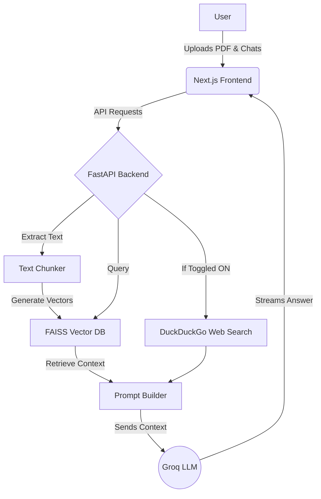

# NeuralDoc: AI Document Intelligence Platform 🚀

Welcome to **NeuralDoc**, a modern, production-ready AI Document Assistant seamlessly integrated with a complete DevOps lifecycle. 

This project transforms standard MLOps pipelines into a fully functional **Retrieval-Augmented Generation (RAG)** chatbot platform. Users can upload PDFs, ask questions, augment responses with live web search, and receive context-aware answers in real-time.

---

## ✨ Key Features

- **Premium Interface**: A stunning, dynamic glassmorphism UI built with **Next.js 15**, Tailwind CSS, and Framer Motion. Features drag-and-drop document uploads, typing animations, and source citations.
- **High-Performance Backend**: A blazing fast **FastAPI** server that handles asynchronous document parsing, semantic text chunking, and LLM orchestration.
- **RAG Engine**: 
  - **Embeddings**: Uses `sentence-transformers` to generate deep semantic vector representations of your documents.
  - **Vector Database**: Uses `faiss-cpu` for instant, localized similarity search.
  - **Live Web Search**: Integrated `DuckDuckGo` searching to fetch live internet context when toggled ON.
- **Lightning LLM**: Powered by the **Groq API** (using the new `llama-3.1-8b-instant` model) for near-zero latency generation.
- **DevOps & Cloud Ready**: Ships with a single-container multi-stage Docker build, Kubernetes manifests, Jenkins CI/CD pipelines, and AWS deployment scripts.

---

## 🏗️ Architecture Workflow



---

## 🚀 Quick Start (Local Docker Deployment)

Get the platform running on your local machine in under 5 minutes.

### 1. Configure Environment Variables
Create a `.env` file in the root directory:
```env
# Required: Get your free API key at console.groq.com
GROQ_API_KEY=gsk_your_api_key_here

# Optional: To automatically backup PDFs to AWS S3
# S3_DOCUMENT_BUCKET=your_s3_bucket_name
```

### 2. Build the Multi-Stage Image
This step compiles the Next.js static frontend and installs the required Python ML libraries.
```bash
docker build -t mlops-rag-test .
```

### 3. Run the Container
```bash
docker run -d -p 8000:8000 --env-file .env mlops-rag-test
```

### 4. Access the UI
Open your browser and navigate to **[http://localhost:8000](http://localhost:8000)**.
Drag and drop a PDF onto the screen, wait for it to process, and start chatting!

---

## ☁️ Cloud & DevOps Deployment

This project is built to scale and includes ready-to-use DevOps configurations.

### Option A: Jenkins CI/CD to Kubernetes
The included `Jenkinsfile` provides a complete CI/CD pipeline:
1. Pushing to the `main` branch triggers the Jenkins pipeline.
2. Jenkins builds the Docker image and pushes it to an AWS ECR (Elastic Container Registry).
3. Jenkins applies the `k8s/deployment.yaml` to deploy the updated image to your Kubernetes cluster.

### Option B: Raw AWS EC2 Deployment
Inside the `cloud/aws/ec2-s3/` directory, you'll find initialization scripts:
- `user-data.sh`: A cloud-init script that automatically installs Docker, fetches this repository, and boots the container when the EC2 instance turns on.
- `deploy.sh`: A helper bash script to provision the EC2 infrastructure.

---

## 📡 API Endpoints

The FastAPI backend exposes the following routes:

- `POST /api/upload`: Upload PDF/TXT documents for text extraction and vector embedding.
- `POST /api/chat`: Send a query, retrieve FAISS context, execute web search (if enabled), and generate an LLM response.
- `GET /api/documents`: List all currently indexed documents in the FAISS database.
- `DELETE /api/documents/{filename}`: Remove a document and its embeddings from the index.
- `GET /api/health`: Standard readiness probe for Kubernetes health checking.

---
*Built with ❤️ for production AI Document Intelligence.*