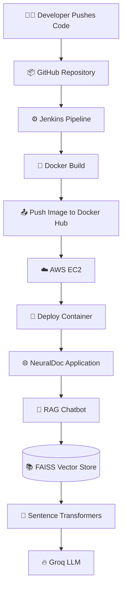
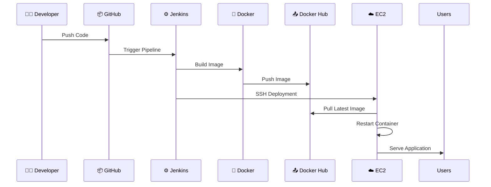
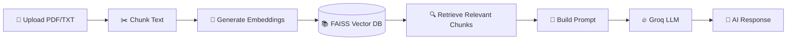
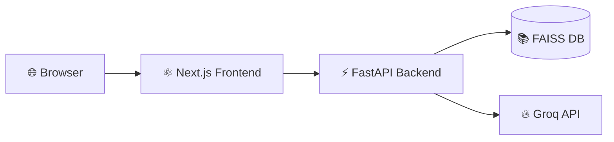
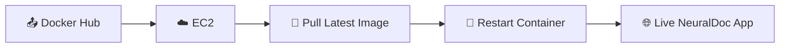

<div align="center">


<br/>

# 🧠 NeuralDoc

### AI-Powered Document Intelligence & MLOps Platform

Upload PDFs • Chat with Documents • RAG Search • Groq LLM • CI/CD to AWS EC2

<br/>

[](https://nextjs.org/)
[](https://react.dev/)
[](https://fastapi.tiangolo.com/)
[](https://python.org/)
[](https://docker.com/)
[](https://jenkins.io/)
[](https://aws.amazon.com/)
[](https://groq.com/)

<br/>

### 🔥 End-to-End AI + MLOps + RAG Deployment Pipeline

</div>

---

# 📌 Overview

**NeuralDoc** is a full-stack AI-powered **Retrieval-Augmented Generation (RAG)** platform that allows users to:

- 📄 Upload PDF/TXT documents
- 🤖 Chat with documents using AI
- 🔍 Perform semantic vector search
- 🌐 Enhance responses using live web search
- 🧠 Generate contextual answers using Groq LLM
- 🚀 Deploy automatically to AWS EC2 using Jenkins CI/CD

The entire system is fully containerized using Docker and follows a production-style MLOps workflow.

---


---

---


# 🏗️ System Architecture



---

# ⚡ Core Features

## 🤖 AI / RAG Features

- 📄 PDF & TXT ingestion
- 🔍 Semantic document retrieval
- 🧠 Context-aware conversational AI
- 💬 Chat memory support
- 📚 FAISS vector indexing
- 🌐 DuckDuckGo web search integration
- 🔥 Groq LLM inference
- ⚡ Fast document embedding pipeline

---

## ⚙️ MLOps Features

- 🐳 Multi-stage Docker builds
- 🔄 Jenkins CI/CD automation
- ☁️ AWS EC2 deployment
- 📦 Docker Hub registry integration
- 🔐 Environment-based configuration
- 📊 MLflow-ready architecture
- 🚀 Automated production deployment

---

# 🧱 Tech Stack

| Category | Technology |
|---|---|
| Frontend | Next.js + React + TypeScript |
| Backend | FastAPI + Uvicorn |
| AI/LLM | Groq API |
| Embeddings | Sentence Transformers |
| Vector DB | FAISS |
| Search | DuckDuckGo Search |
| Storage | Local FS + Optional AWS S3 |
| Containerization | Docker |
| CI/CD | Jenkins |
| Cloud | AWS EC2 |
| Version Control | GitHub |
| MLOps | MLflow |
| Styling | TailwindCSS + Framer Motion |

---

# 🔄 Complete CI/CD Flow



---

# 🧠 AI/RAG Workflow



---

# 📂 Project Structure

```bash
ML_platform/
│
├── frontend/                      # Next.js frontend
│
├── src/
│   ├── api/                       # FastAPI routes
│   ├── rag/                       # RAG pipeline
│   ├── storage/                   # Storage handlers
│   ├── models/                    # ML model stubs
│   └── utils/                     # Utility functions
│
├── models/
│   ├── checkpoints/
│   └── production/
│
├── configs/
│   └── config.yaml
│
├── cloud/
│   └── aws/ec2-s3/
│
├── k8s/                           # Optional future Kubernetes setup
│
├── Dockerfile
├── Jenkinsfile
├── docker-compose.yml
├── requirements.txt
└── README.md
```

---

# 🌐 Frontend ↔ Backend Communication

The frontend and backend run inside the SAME Docker container.



### Example API Call

```ts
await fetch("/api/chat", {
  method: "POST",
  headers: {
    "Content-Type": "application/json",
  },
  body: JSON.stringify({
    query,
    use_web_search,
  }),
});
```

---

# 🐳 Docker Setup

## Build Image

```bash
docker build -t neuraldoc .
```

## Run Container

```bash
docker run -d -p 8000:8000 --env-file .env neuraldoc
```

---

# ⚙️ Jenkins Setup

## Run Jenkins Container

```bash
docker run -d ^
  --name jenkins ^
  --privileged ^
  -p 8080:8080 ^
  -p 50000:50000 ^
  -v jenkins_home:/var/jenkins_home ^
  -v //var/run/docker.sock:/var/run/docker.sock ^
  jenkins/jenkins:lts-jdk17
```

---

# ☁️ AWS EC2 Deployment

## Deployment Flow



---

# 🔐 Environment Variables

Create a `.env` file:

```env
GROQ_API_KEY=gsk_your_api_key

# Optional
S3_DOCUMENT_BUCKET=your_bucket
AWS_ACCESS_KEY_ID=
AWS_SECRET_ACCESS_KEY=
AWS_DEFAULT_REGION=
```

---

# 🚀 Running Locally

## Backend

```bash
uvicorn src.api.main:app --reload
```

---

## Frontend

```bash
cd frontend

npm install

npm run dev
```

---

# 🧪 API Endpoints

| Method | Endpoint | Description |
|---|---|---|
| GET | `/api/health` | Health check |
| POST | `/api/upload` | Upload PDF/TXT |
| POST | `/api/chat` | Chat with documents |
| GET | `/api/documents` | List indexed docs |
| DELETE | `/api/documents/{name}` | Delete document |

---

# 📦 Jenkins Pipeline Stages

| Stage | Action |
|---|---|
| Checkout | Clone GitHub repository |
| Docker Build | Build application image |
| Docker Push | Push image to Docker Hub |
| Deploy | Deploy latest image to EC2 |

---

# 🔥 Production Deployment

## EC2 Container Run

```bash
docker pull aryansingh833/aryansingh833:latest

docker stop rag-app || true

docker rm rag-app || true

docker run -d \
  --name rag-app \
  --env-file .env \
  -p 80:8000 \
  aryansingh833/aryansingh833:latest
```

---

# 📊 Current Infrastructure

| Component | Status |
|---|---|
| GitHub Repo | ✅ Active |
| Docker Build | ✅ Working |
| Jenkins Pipeline | ✅ Working |
| Docker Hub Push | ✅ Working |
| AWS EC2 Deploy | ✅ Working |
| FastAPI Backend | ✅ Working |
| Next.js Frontend | ✅ Working |
| RAG Pipeline | ✅ Working |

---

# 📈 Future Improvements

- ☸️ Kubernetes deployment
- 📊 Monitoring dashboards
- 🔒 HTTPS + Nginx reverse proxy
- ⚡ GPU inference optimization
- 🧠 Multi-agent orchestration
- 📦 Smaller runtime images
- 🔄 Blue/Green deployment
- 📡 GitHub Webhooks
- 📊 Advanced observability

---

# 🛡️ Security Notes

- ❌ Never commit:
  - `.env`
  - `*.pem`
  - API keys
  - model weights

- ✅ Already ignored:
  - `frontend/node_modules`
  - `frontend/out`
  - `.next`
  - `.env`
  - `*.pem`

---

# 👨‍💻 Author

# Aryan Singh

🎓 B.Tech CSE Student  
🤖 Machine Learning & MLOps Developer  
🚀 AI Infrastructure Enthusiast

### GitHub

https://github.com/AryanSing833

---

# ⭐ Repository

## 🔗 GitHub Repo

https://github.com/AryanSing833/ML_plateform

---

# 🚀 NeuralDoc — From AI Models to Production Deployment

### Built with ❤️ using AI + MLOps + Cloud Infrastructure
