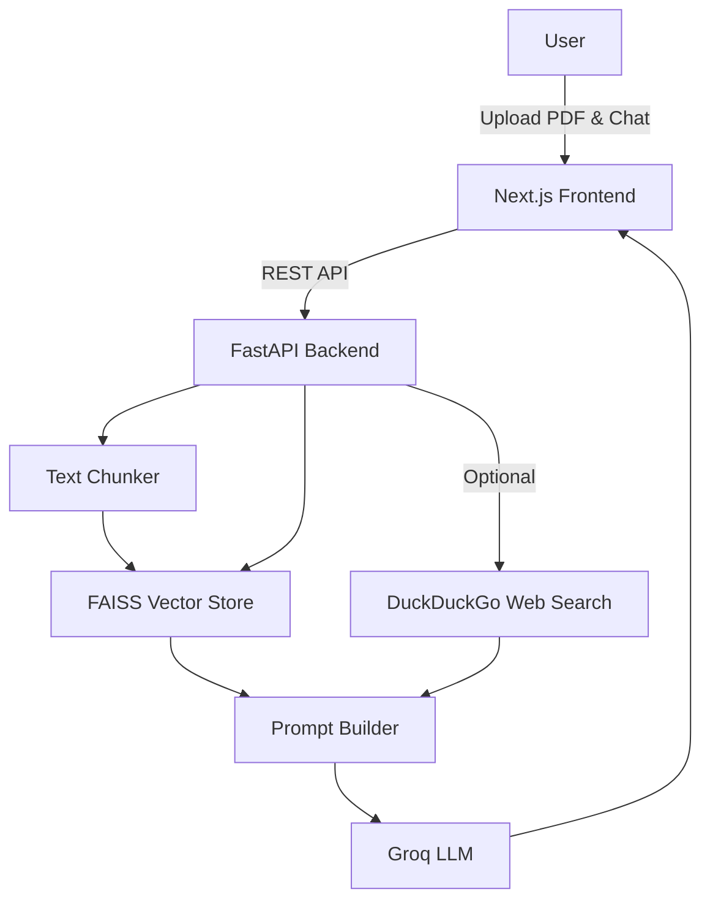
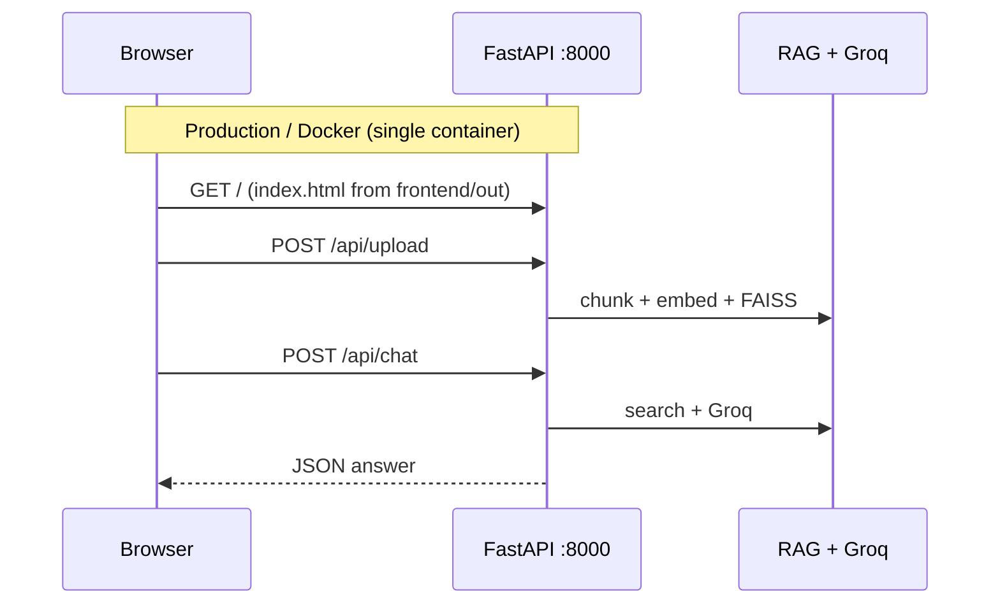

# NeuralDoc — AI Document Intelligence Platform

**NeuralDoc** is a production-ready RAG (Retrieval-Augmented Generation) platform. Users upload PDFs, chat over indexed content, optionally augment answers with live web search, and get low-latency responses via the Groq API.

Repository: [github.com/AryanSing833/ML_plateform](https://github.com/AryanSing833/ML_plateform)

---

## Features

| Area | Details |
|------|---------|
| **Frontend** | Next.js 15, Tailwind CSS, glassmorphism UI — drag-and-drop uploads, chat, citations |
| **Backend** | FastAPI — async parsing, chunking, embedding, LLM orchestration |
| **RAG** | `sentence-transformers` embeddings + FAISS similarity search |
| **Web search** | DuckDuckGo integration (optional per request) |
| **LLM** | Groq API (`llama-3.1-8b-instant`) |
| **Storage** | Local filesystem or optional AWS S3 backup |
| **DevOps** | Multi-stage Docker, Jenkins → Docker Hub → EC2, Kubernetes manifests, AWS EC2/S3 scripts |

---

## Architecture



---

## How the frontend connects to the backend

There is **no separate frontend server in production**. The UI and API share **one origin** (same host and port). That is why you will not see a `frontend/out/` folder in Git — it is created at build time.

### Connection flow



| Step | What happens |
|------|----------------|
| 1. Build UI | `frontend/` → `npm run build` → static files in **`frontend/out/`** (`next.config.ts` sets `output: 'export'`) |
| 2. Docker image | Stage 1 builds Next.js; Stage 2 copies `frontend/out` into the Python image (`Dockerfile`) |
| 3. Serve everything | `src/api/main.py` registers API routes **and** serves `frontend/out` on port **8000** |
| 4. Browser calls API | `page.tsx` uses **relative** URLs — no `NEXT_PUBLIC_API_URL` |

### Files involved in the link

```
frontend/
├── next.config.ts          # output: 'export' → static HTML/JS in frontend/out/
└── src/app/page.tsx        # fetch("/api/chat"), fetch("/api/upload"), etc.

frontend/out/                 # GENERATED (not in repo) — created by npm run build
├── index.html
├── _next/                    # JS/CSS bundles
└── ...

src/api/
├── main.py                   # Mounts frontend/out + includes upload/chat routers
└── routes/
    ├── chat.py               # POST /api/chat
    └── upload.py             # POST /api/upload, GET/DELETE /api/documents
```

### API calls from the UI (`page.tsx`)

All requests go to the **same host** as the page (e.g. `http://localhost:8000` or your EC2 IP):

| Frontend call | Backend handler |
|---------------|-----------------|
| `fetch("/api/documents")` | List indexed files |
| `fetch("/api/upload", { method: "POST", body: formData })` | Upload PDF/TXT |
| `fetch("/api/chat", { method: "POST", body: JSON })` | RAG + optional web search |
| `fetch("/api/documents/{name}", { method: "DELETE" })` | Remove from FAISS |

Example from the UI:

```ts
// frontend/src/app/page.tsx — relative path = same server as the HTML
const res = await fetch("/api/chat", {
  method: "POST",
  headers: { "Content-Type": "application/json" },
  body: JSON.stringify({ query: userMsg, use_web_search: useWebSearch }),
});
```

FastAPI wiring in `main.py`:

```python
# API routes registered first
app.include_router(upload.router)
app.include_router(chat.router)

# Then static UI from frontend/out (if folder exists after build)
STATIC_DIR = os.path.join(os.getcwd(), "frontend", "out")
# ... serves /, /_next/*, and SPA fallback to index.html
```

### Why `frontend/out/` is missing from the directory tree

| Location | In Git? | When it appears |
|----------|---------|-----------------|
| `frontend/src/` | Yes | Source code you edit |
| `frontend/out/` | **No** (build artifact) | After `cd frontend && npm run build` or `docker build` |

### Run modes

| Mode | Command | Frontend ↔ Backend |
|------|---------|-------------------|
| **Recommended** | `docker build` + `docker run -p 8000:8000` | Both on `:8000` — works out of the box |
| **Manual combined** | `cd frontend && npm run build` then `uvicorn src.api.main:app --port 8000` | Open `http://localhost:8000` only |
| **Split dev (two ports)** | `npm run dev` on `:3000` + API on `:8000` | **Broken by default** — `/api/*` hits Next.js, not FastAPI. Use Docker or the manual combined flow above. |

---

## Project structure

```
ML_plateform/
├── README.md                 # Project documentation
├── Dockerfile                # Multi-stage: Next.js build + Python API
├── docker-compose.yml        # Local multi-service compose (if used)
├── requirements.txt          # Python dependencies
├── Makefile                  # lint, test, train, inference helpers
├── Jenkinsfile               # CI/CD: build → Docker Hub → EC2 deploy
├── project_config.json       # Generator metadata (framework, cloud, CI/CD)
├── .dockerignore
│
├── frontend/                 # Next.js 15 UI source (see "Frontend connects" above)
│   ├── package.json
│   ├── next.config.ts      # output: 'export' → builds to frontend/out/
│   ├── tsconfig.json
│   ├── public/               # Static assets (SVG icons)
│   ├── out/                  # ⚠ BUILD OUTPUT — not in Git; created by npm run build / Docker
│   │   ├── index.html        # Served by FastAPI at http://host:8000/
│   │   └── _next/            # Compiled JS/CSS
│   └── src/
│       ├── app/
│       │   ├── layout.tsx
│       │   ├── page.tsx      # UI + fetch("/api/...") → FastAPI on same port
│       │   └── globals.css
│       └── lib/
│           └── utils.ts
│
├── src/                      # Python application
│   ├── api/
│   │   ├── main.py           # FastAPI app, static frontend mount, /api/health
│   │   ├── dependencies.py   # Shared DI (vector store, clients)
│   │   └── routes/
│   │       ├── upload.py     # POST /api/upload
│   │       └── chat.py       # POST /api/chat
│   ├── rag/
│   │   ├── chunker.py        # PDF/text splitting
│   │   ├── embeddings.py     # Sentence-transformer vectors
│   │   ├── vector_store.py   # FAISS index CRUD + search
│   │   ├── prompt_builder.py # Context assembly for LLM
│   │   ├── groq_client.py    # Groq API client
│   │   ├── web_search.py     # DuckDuckGo search
│   │   └── memory.py         # Session / chat memory
│   ├── storage/
│   │   ├── local_storage.py  # On-disk document storage
│   │   └── s3_storage.py     # Optional S3 uploads
│   ├── models/               # Legacy MLOps model stubs (classification, etc.)
│   ├── utils/
│   │   └── training_utils.py
│   ├── train.py              # Training entrypoint
│   └── inference.py          # Inference entrypoint
│
├── configs/
│   └── config.yaml           # App / training configuration
│
├── data/                     # Dataset layout (MLOps convention)
│   ├── raw/
│   ├── processed/
│   └── external/
│
├── models/                   # Saved model artifacts
│   ├── checkpoints/
│   └── production/
│
├── k8s/                      # Kubernetes deployment (optional)
│   ├── namespace.yaml
│   ├── configmap.yaml
│   ├── deployment.yaml
│   ├── service.yaml
│   ├── ingress.yaml
│   └── hpa.yaml
│
├── cloud/aws/ec2-s3/         # AWS EC2 + S3 provisioning
│   ├── deploy.sh             # Infrastructure helper
│   ├── user-data.sh          # Cloud-init: Docker + app bootstrap
│   ├── cloud-config.yaml
│   ├── iam-role.json
│   └── s3-bucket-policy.json
│
├── scripts/                  # Utility / automation scripts
├── notebooks/                # Jupyter experiments
└── mlruns/                   # MLflow run logs (generated locally)
```

### Key paths

| Path | Role |
|------|------|
| `src/api/main.py` | API entrypoint; serves built UI from `frontend/out` |
| `src/rag/` | Full RAG pipeline (chunk → embed → retrieve → prompt) |
| `frontend/src/app/page.tsx` | UI; calls `/api/*` on the same host as the page |
| `frontend/out/` | Built static site (after `npm run build`); served by `main.py` |
| `frontend/next.config.ts` | `output: 'export'` — required for FastAPI static hosting |
| `Jenkinsfile` | Automated build, push, and EC2 rollout |
| `cloud/aws/ec2-s3/` | Bare-metal AWS deployment without Jenkins |

---

## Quick start (Docker)

### 1. Environment

Create `.env` in the project root:

```env
GROQ_API_KEY=gsk_your_key_here

# Optional — backup uploads to S3
# S3_DOCUMENT_BUCKET=your-bucket-name
# AWS_ACCESS_KEY_ID=
# AWS_SECRET_ACCESS_KEY=
```

### 2. Build and run

```bash
docker build -t neuraldoc .
docker run -d -p 8000:8000 --env-file .env neuraldoc
```

Open **[http://localhost:8000](http://localhost:8000)** — upload a PDF, wait for indexing, then chat.

### 3. Local development (without Docker)

Build the frontend first so `frontend/out/` exists, then start the API (it serves both UI and `/api/*`):

```bash
cd frontend
npm install
npm run build          # creates frontend/out/

cd ..
pip install -r requirements.txt
set PYTHONPATH=.       # Windows: set PYTHONPATH=.
                       # Linux/Mac: export PYTHONPATH=.
uvicorn src.api.main:app --reload --port 8000
```

Open **http://localhost:8000** (not `:3000`). Do not use `npm run dev` alone unless you add a Next.js proxy to port 8000 — the app is designed for the combined setup above.

---

## Deployment

### Option A — Jenkins CI/CD → EC2 (current pipeline)

The `Jenkinsfile` runs on push to `main`:

1. **Checkout** — clone from SCM  
2. **Build** — `docker build -t <image>`  
3. **Push** — Docker Hub (`dockerhub-creds` Jenkins credential)  
4. **Deploy** — SSH to EC2 (`ec2-ssh-key`), pull image, restart `rag-app` container on port 80  

**Jenkins credentials required:**

| ID | Purpose |
|----|---------|
| `dockerhub-creds` | Docker Hub login |
| `ec2-ssh-key` | SSH private key for EC2 |

**Pipeline environment variables** (edit in `Jenkinsfile`):

- `IMAGE_NAME` — e.g. `youruser/neuraldoc:latest`
- `EC2_IP` — target instance public IP

On EC2, ensure `.env` exists in the home directory used by the deploy script and Docker is installed.

### Option B — AWS EC2 / S3 scripts

Use `cloud/aws/ec2-s3/`:

- `user-data.sh` — cloud-init: install Docker, clone repo, start container  
- `deploy.sh` — provision EC2 and related resources  
- `iam-role.json`, `s3-bucket-policy.json` — IAM and bucket policies  

### Option C — Kubernetes

Apply manifests under `k8s/` when you have a cluster and container registry:

```bash
kubectl apply -f k8s/namespace.yaml
kubectl apply -f k8s/
```

Update `k8s/deployment.yaml` with your image name and registry before deploying.

---

## API reference

| Method | Endpoint | Description |
|--------|----------|-------------|
| `GET` | `/api/health` | Health / readiness probe |
| `POST` | `/api/upload` | Upload PDF/TXT; chunk and embed into FAISS |
| `POST` | `/api/chat` | Query with RAG (+ optional web search) |
| `GET` | `/api/documents` | List indexed documents |
| `DELETE` | `/api/documents/{filename}` | Remove document from index |

---

## Makefile commands

```bash
make install      # Production dependencies
make install-dev  # Dev dependencies
make test         # pytest with coverage
make lint         # flake8 + mypy
make format       # black + isort
make train        # Run src/train.py
make inference    # Run src/inference.py
make clean        # Remove caches and artifacts
```

---

## Security notes

- Never commit `.env`, `*.pem`, or API keys to Git.  
- Add `*.pem` and `.env` to `.gitignore` if not already present.  
- Rotate `GROQ_API_KEY` and cloud credentials if they were ever exposed.  
- Restrict EC2 security groups to required ports (e.g. 80/443, 22 from trusted IPs only).

---

## Tech stack

- **UI:** Next.js 15, TypeScript, Tailwind CSS  
- **API:** FastAPI, Uvicorn  
- **ML / RAG:** PyTorch ecosystem, sentence-transformers, FAISS, PyPDF  
- **LLM:** Groq  
- **CI/CD:** Jenkins, Docker Hub  
- **Cloud:** AWS EC2, S3; optional Kubernetes  

---

*Built for production AI document intelligence.*
